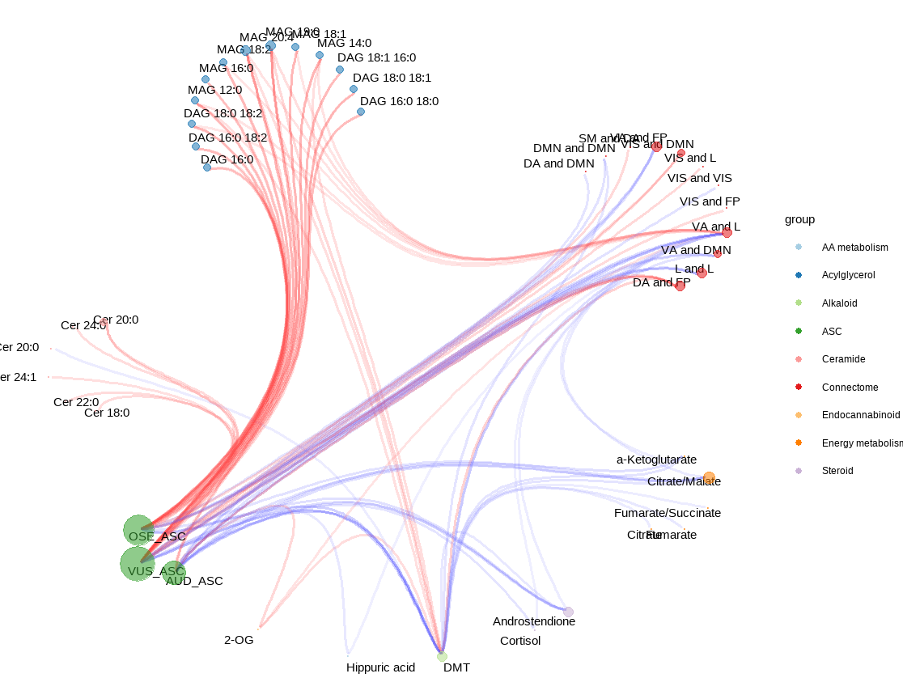

<meta name="google-site-verification" content="OfjbDQ0ULeF6SeHmr36VmNxlkXrVZSAMSArrW0gTIYw" />

:::: hero
::: hero-content
<h1 class="hero-title">

</h1>

<h1 class="hero-title">

## Fran Madrid-Gambin

</h1>

<h2 class="hero-subtitle">

#### Investigador Biomédico · Científico de Datos · Divulgador Científico

</h2>

<p>Construyo sistemas biomédicos basados en datos</p>

Traduzco complejidad científica en ideas entendibles

</p>

[Ver proyectos](#selected-work){.btn .btn-primary .me-2} [Sobre mí](sobre_mi.qmd){.btn .btn-outline-light}
:::
::::

::: hero-spacer
:::

::::: section-light
:::: about-container
{.profile-pic}

::: about-text
### A qué me dedico

Soy científico biomédico que trabaja en la intersección que existe entre la biología computacional, la biomedicina y la ciencia de datos.

Mi investigación se centra en la metabolómica, integración multi-ómica y análisis de grandes cohortes humanas complejas, liderando proyectos de descubrimiento de biomarcadores en envejecimiento, cáncer, fragilidad y neurodegeneración. Combino bioquímica periférica, neuroimagen y aprendizaje automático (*Machine Learning*) dentro de marcos de medicina traslacional y medicina de precisión.

Actualmente desarrollo una línea emergente de investigación con psicodélicos (psilocibina, ayahuasca, 2-CB) en el **Instituto de Investigación del Hospital del Mar**, en colaboración con la **Universidad de Maastricht**, con trabajos publicados sobre la integración del eje Mente-Cerebro-Cuerpo tras la ingesta de ayahuasca (dimetiltriptamina + B-carbolinas).

Más allá del desarrollo de modelos de datos, también me interesa que el conocimiento científico sea transferible — a través de escritura, docencia y divulgación científica en formato audiovisual.

Mi trabajo abarca la investigación clínica, el diseño de sistemas de análisis de datos y la comunicación científica.
:::
::::
:::::

:::::::: section-dark
## Proyectos destacados {#selected-work}

::::::: cards
::: card
### Divulgación científica y educación

Transformo la investigación biomédica y de las ciencias de la salud en narrativas accesibles para el público general, sin perder el rigor científico y, cuando es posible, con una pizca de sentido del humor. Desarrollo contenidos educativos a través de charlas, escritura y formatos audiovisuales.

{width="200px" style="margin-left: 0px;margin-bottom:20px;"}

<br>

[Ver programa →](science-communication.qmd){.btn .btn-primary}

**Enfoque:** Transferencia de conocimiento · Participación pública · Pedagogía científica
:::

::: card
### B-HAPPY

Investigador principal del proyecto **Barcelona Hormones And Pregnancy – Pollution & Young Health (B-HAPPY)**, una iniciativa que estudia cómo la exposición ambiental urbana de Barcelona influye en la regulación hormonal relacionada con el estrés durante el embarazo y sus efectos en la salud materno-infantil.

<br>

{width="200px" style="margin-left: 0px;margin-bottom:20px;"}

<br>

[Leer proyecto completo →](B-HAPPY.qmd){.btn .btn-primary}

**Enfoque:** Investigación traslacional · Bienestar · Salud ambiental
:::

::: card
### Investigación en Integromics con sustancias Psicodélicas

Desarrollo de marcos analíticos integrativos para estudiar los efectos bioquímicos y neurobiológicos de la ayahuasca, psilocibina, 2-CB y otros compuestos relacionados (DMT, B-carbolinas), conectando la biología de sistemas con la neurociencia clínica.

<br>

{width="300px" style="margin-left: 0px;margin-bottom:20px;"}

<br>

[Leer proyecto completo →](psychedelic-integromics.qmd){.btn .btn-primary}

**Enfoque:** Integración multi-capa de datos · Biología de sistemas · Psicodélicos
:::

::: card
### Metabolómica del consumo de cannabis e intoxicación aguda

El cannabis suele percibirse como una “droga blanda”. Sin embargo, la intoxicación aguda es una causa cada vez más frecuente de visitas a urgencias — especialmente con el aumento de productos de **THC de alta potencia**, comestibles y derivados sintéticos.

Este proyecto analiza las características clínicas, bioquímicas y epidemiológicas de la intoxicación aguda por cannabis en entornos sanitarios reales.

<br> <br>

[Leer proyecto completo →](cannabis.qmd){.btn .btn-primary}

**Enfoque:** Reproducibilidad · Diseño de flujos de trabajo · Modelización estadística
:::
:::::::
::::::::

::: section-light2
## 🚀 En qué estoy trabajando actualmente

-   Modelado estadístico avanzado aplicado a datos biomédicos\
-   Supervisión de una tesis doctoral sobre psicodélicos en *integromics* cerebro-cuerpo en humanos\
-   Investigador principal del proyecto **B-HAPPY**, financiado por el Ayuntamiento de Barcelona\
-   Expansión de iniciativas de divulgación científica
:::

:::::: section-dark2
## 🎥 Últimos vídeos

El rigor científico no tiene por qué ser aburrido. Mi trabajo en divulgación científica combina precisión metodológica con claridad narrativa — y una dosis saludable de humor — para hacer que las ideas complejas sean comprensibles y estimulantes.

::::: videos-grid
::: video-wrapper
<iframe src="https://www.youtube.com/embed/iAuO7ml9i54" title="YouTube Short" frameborder="0" allow="accelerometer; autoplay; clipboard-write; encrypted-media; gyroscope; picture-in-picture; web-share" allowfullscreen>

</iframe>
:::

::: video-wrapper
<iframe src="https://www.youtube.com/embed/g-Zoae5ouqs" title="YouTube Short" frameborder="0" allow="accelerometer; autoplay; clipboard-write; encrypted-media; gyroscope; picture-in-picture; web-share" allowfullscreen>

</iframe>
:::
:::::

```{=html}
<script type="application/ld+json">
{
  "@context": "https://schema.org",
  "@type": "Person",
  "name": "Francisco Madrid-Gambin",
  "url": "https://francisco-madrid-gambin.github.io",
  "jobTitle": "Computational Biologist and Data Scientist",
  "affiliation": {
    "@type": "Organization",
    "name": "Hospital del Mar Research Institute"
  },
  "sameAs": [
    "https://scholar.google.es/citations?user=O6jL4bcAAAAJ",
    "https://www.linkedin.com/in/francisco-m-74489010a/",
    "https://github.com/Francisco-madrid-gambin"
  ]
}
</script>
```
::::::
